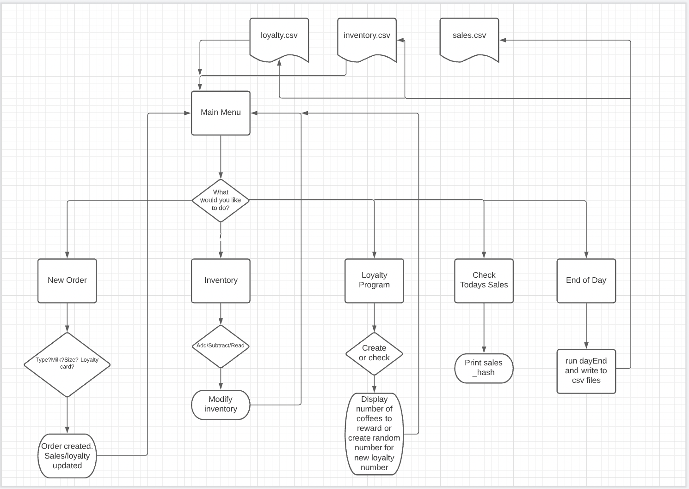

# CoffeePOS Documentation - Josh Stephenson T1A3

Github repository : https://github.com/Verbingnoun/CoffeePOS

## Software Development Plan

Develop a statement of purpose and scope for your application. It must include:

- describe at a high level what the application will do
- identify the problem it will solve and explain why you are developing it
- identify the target audience
- explain how a member of the target audience will use it

My app will function as a very basic point of sale(pos) system for a coffee shop. The user, whom will be the person selling the coffee, will be able to create a coffee order with parameters for how the customer would like their coffee, check their current inventory and check on a customers loyalty program. If time allows, I would like to create a sales function as well, where each coffee sold will be recorded by size so at the conclusion of the day the user can see their coffee revenue.

The reason I am developing this app is to provide a zero cost basic solution for POS for a coffee shop. There are many POS systems out there but they can be extremely expensive. My app will be completely free to whomever wants to use it and will be very user friendly.

This app is obviously targetted towards small coffee shop owners as this will be a free and easy way to manage the selling of coffee, tracking inventory and the implimentation of a loyalty program built into the application and potentially sales functionality if time allows.

The entire program will run through terminal with the user interacting through text based prompts. I have designed it to be operated by any user regardless of coding experience. The user simply needs to read on screen and input what they would like to do. For example, enter '1' to create an order from the main menu or enter '2' to access the inventory. The most important function of the app is creating the coffee order and this is done by prompting the user for each parameter for making a coffee ie. Type? Size? Milk? Sugar? At the end of the propmts the entire order will be displayed to screen and if the order is correct, data will be collected and stored from the order and the user will be returned to the main menu for the next function to be executed.

## Develop a list of features that will be included in the application. It must include:

- at least THREE features
- describe each feature

### Feature 1 - Create Coffee Order

 After the user navigates from the main menu to the coffee order menu, the terminal will clear and the user will be prompted for what type of coffee, if they want milk or sugar and the size and finally if they have a loyalty number Once these values are given they are stored in an instance variable(@type, @size, @milk, @sugar, @loyalty). The end of the order the user will be prompted to check the order and if it's correct the @loyalty variable will be checked against a csv file containing loyalty numbers and increment a hash by 1 if it's less than 5 and gives out a free coffee if it's 5. @type variable will check another csv file and tick up an array to track how many of each size of coffee were sold. Input errors are largely handled by if statements in the code but I do have a rescue in place if the size variable is not large/medium/small and gets the user to create the order again.

 ### Feature 2 - Read/Edit inventory

 Same as above, once the user navigates to this menu the terminal will clear and the current inventory is displayed to screen. All inventory items will be displayed as a key/value pair in a hash The user will then be prompted to enter either 1 to add to inventory, 2 to subtract from inventory and 3 toreturn to main menu. Methods are written to take input from user and either add or subtract that number from the hash value. If the user inputs an invalid value for either item or quantity when editing the inventory a rescue condition will prompt the user to try again.

 ### Feature 3 - Check loyalty

 As above, once user navigates to loyalty menu from main menu, terminal will clear and user will be prompted to enter a number, which will be checked against a csv file containing a hash. The hash value will be output to screen to the customer can be informed of their progress to a free coffee. Input errors by the user will result in the loyalty number not being found. Thankfully no special error handling was needed in this feature due to the limited user input.

## Develop a diagram which describes the control flow of your application. Your diagram must:

- show the workflow/logic and/or integration of the features in your application for each feature.
- utilise a recognised format or set of conventions for a control flow diagram, such as UML.

Control Flow Diagram :

## Develop an implementation plan which:
- outlines how each feature will be implemented and a checklist of tasks for each feature
- prioritise the implementation of different features, or checklist items within a feature
- provide a deadline, duration or other time indicator for each feature or checklist/checklist-item

Utilise a suitable project management platform to track this implementation plan

> Your checklists for each feature should have at least 5 items.

Link to trello board : https://trello.com/b/8hV9P9gw/coffeepos

Initially I had a lot of difficulty using the trello board because I didn't have a solid understanding of how my project was going to look by completion. It was difficult to set time goals and checklists when I was feeling my way through the coding process at every step of the way. Once I became more comfortable towards the end of the project I started to see more value in the process as I had a better understanding of my own skills and how long/how difficult the tasks I set for myself would be.

## Design help documentation which includes a set of instructions which accurately describe how to use and install the application.

You must include:
- steps to install the application
- any dependencies required by the application to operate
- any system/hardware requirements

1. To use CoffeePOS, first you will need to install ruby as that is the environment the program runs in. installation will vary between operating systems. Go to https://www.ruby-lang.org/en/documentation/installation/#homebrew and follow the instructions for your operating system.

2. Now that you have ruby installed it is time to install the gems required to run the program. Gems are software packages which add functionality to the base library of Ruby. There is a script that comes with the program called install_script.sh. You will need to run this script from your command line to install the gems.

First, navigate to the directory where CoffeePOS and install_script.sh are located. Secondly, run this in terminal :
    
    chmod +x ./install_script.sh

and finally :

    ./install_script.sh

This should install all the required gems and output a message to say that this was completed.

3. With the gems installed we can finally get to running the application. First, in the same location as  the previous step, run this :

    chmod +x ./install_script.sh

You should notice that there is a csv file contained in this directory. There should be two files in there, loyalty.csv and inventory.csv. Please do not remove these files as the program will not run without them. Inventory.csv contains the products you will use in your day to day running of a coffee shop. Once you enter the program you will be able to alter the quantities of these products. Loyalty.csv will start empty and will populate with the loyalty program numbers generated by CoffeePOS when you ask it to. There should be no need to edit either of these documents.

Finally, run this :

    ./coffee_pos.sh

This should open the program.

4. Welcome to CoffeePOS! From here you will be able to use your keyboard to input options to tell the program what you would like to do. Simply put in the number which corresponds with the option on screen.

    - Press 1 to create a coffee order.
    - Press 2 to edit your inventory
    - Press 3 to create loyalty program numbers or check the progress of an existing number
    - Press 4 to output your sales data for today
    - Press 5 to save all changes and exit the program.

5. When creating a coffee order, you will be prompted by the program for parameters for the coffee, such as size and type. Next to these prompts, in red, are the responses you should give back. If the response you give back to the program is invalid the order will simply start again. At the end of the order you will be asked to look over the order and confirm if it's correct. If so, the relevant items will be removed from your inventory and the sale will be recorded. You will return to the main menu.

6. Editing your inventory is very simple. The program comes with 4 items built in, cups, sugar, milk and beans. If these items are used when you are creating a coffee order, they will remove a unit from this inventory. However you can also manually edit the inventory if you so desire. Input 1 to edit inventory, input the item you wish to edit and the new quantity. The program will record the change, display it to screen and return you to the menu. 

7. CoffeePOS has a simple loyalty program built into itself. By selecting option 3 you will be able to generate a number which will be unique to the customer. When creating a coffee order, you will be prompted to enter a loyalty program number if one is available. If so, the sale will increase the number of orders that correspond with that loyalty number by 1. If that number is 5, the coffee will be free and the number of orders will reset to zero. You can also check on the progress of a customers number through this menu by selecting 1. Input the customers number and their progress will be displayed on screen.

8. By pressing 4 you can check how many coffees you have sold for the day, organised by size, and your total revenue for the day. Pressing enter will return you to the menu.

9. Once your day is complete, press 5 to record all of your changes to the inventory, your loyalty program and sales data.
At close of business each day. CoffeePOS will generate a .csv file with the current date as the file name (xx_xx_xxxx.csv). You can open this file to check your sales on a given date.

